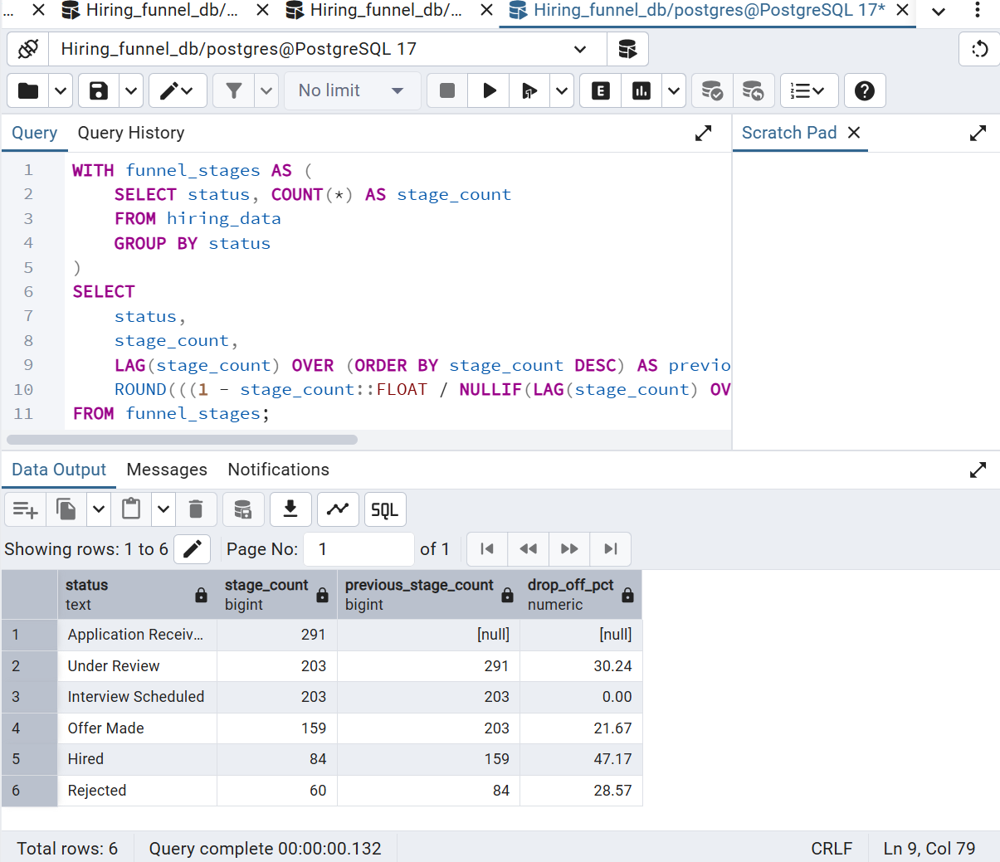
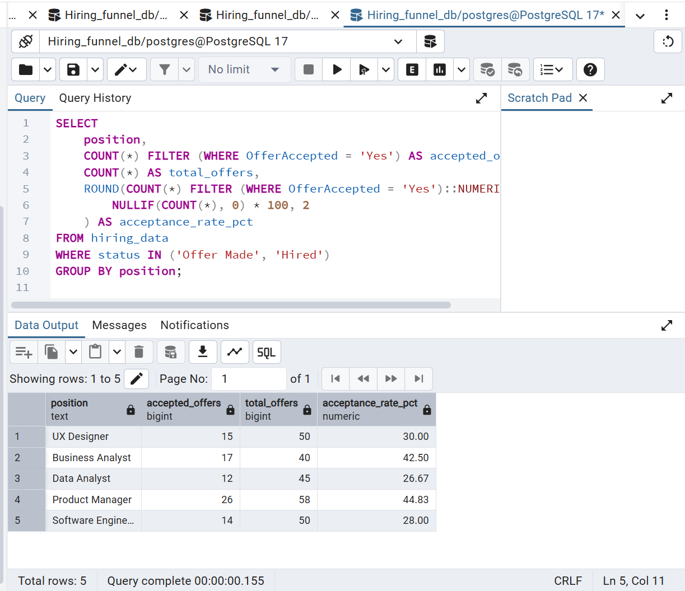
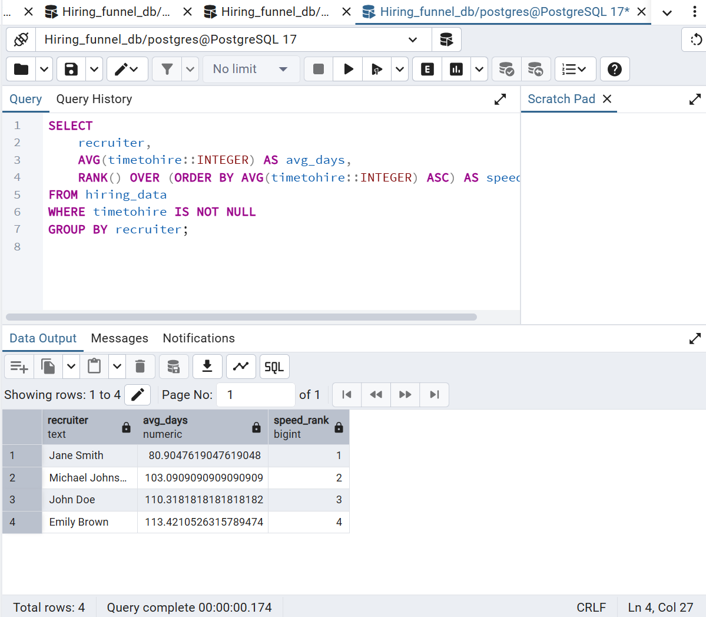

# Hiring Funnel & Bias Analysis (SQL)

# Project Overview
This project analyzes a dataset of 1,000+ candidates to identify inefficiencies in the hiring process and audit for potential bias in education and gender categories.

# Tech Stack
* **Database:** PostgreSQL 17
* **Tool:** pgAdmin 4 / VS Code
* **Language:** SQL (CTEs, Window Functions, Type Casting)

---

# Project Structure
* **data/**: Contains the raw `hiring.csv`.
* **SQL_Queries/**: 
    * `01_setup.sql`: Database schema and table creation.
    * `02_enrichment.sql`: Data cleaning and feature engineering (Gender/Education).
    * `03_analysis.sql`: 10 Business questions answered via SQL.
* **images/**: Screenshots of key query results.

---

# Key Insights & Visuals

### 1. Funnel Drop-off Analysis

**Brief:** This result demonstrates the 'leaky' stages of our recruitment process. By calculating the percentage of candidates lost between the Interview and Offer stages, we can identify exactly where the candidate experience might be failing.

### 2. Education vs. Offer Acceptance

**Brief:** This table cross-references educational background with the likelihood of accepting a job offer. It signals a need to re-evaluate our senior-level compensation packages if higher-tier candidates are declining offers.

### 3. Recruiter Performance Ranking

**Brief:** Using the `RANK()` function, this output benchmarks our recruiting team based on their 'Time-to-Hire.'

---

# Strategic Recommendations
1. **Fix the Technical Interview Leak:** Review interview difficulty to reduce the 40% drop-off rate found.
2. **Standardize Workflows:** Use the "Best Practices" of top-ranked recruiters to reduce company-wide Time-to-Hire.
